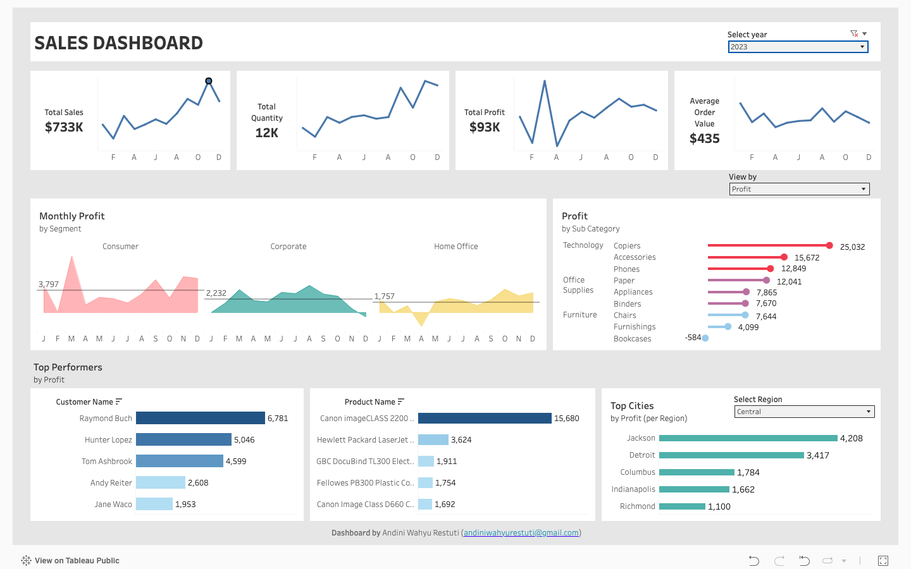

Welcome to my data analytics portfolio!
Explore projects showcasing my data analysis, data visualization, and data storytelling,
focused on solving business questions and delivering actionable insights.

---

## [Project 1: AWS SaaS Profitability Analysis: Dashboard & Deep Dive](https://github.com/Andiniwahyu/SaaS-AWS-Profitability-Analysis)

This comprehensive project combines an interactive dashboard and a deep-dive analysis of SaaS profitability on AWS. It focuses on optimizing product and customer strategies by analyzing sales, profit, and quantity metrics, identifying critical profit drops, and providing actionable recommendations. The goal is to turn raw data into strategic business insights.

---

## [Project 2: SQL Restaurant Exploratory Data Analysis](https://github.com/Andiniwahyu/Restaurant-SQL-Data-Exploration-Project)

This project involves data exploration using PostgreSQL to analyze customer behavior and menu performance from restaurant order data. The objective is to uncover ordering trends and menu profitability, helping to understand customer preferences and optimize menu offerings.

---

## [Project 3: SQL Data Analytics](https://github.com/Andiniwahyu/SQL-data-analytics)

This is a complete SQL project covering data exploration, data analytics, and reporting. It explores key performance metrics, trends over time, customer segmentation, and cumulative sales analysis, demonstrating comprehensive SQL skills for strategic decision-making.

---

## [Project 4: Sales Performance Dashboard](https://github.com/Andiniwahyu/Tableau-Sales-Dashboard)

This project features an interactive Sales Performance Dashboard built with Tableau Public. It aims to monitor key sales metrics, analyze trends, identify top-performing customers and products, and assess regional performance. The dashboard provides a clear overview for strategic decision-making in sales and marketing.

---

## [Project 5: Retail SOP Performance Analysis](https://github.com/Andiniwahyu/SOP-performance)

This personal data project analyzes Standard Operating Procedure (SOP) adherence across 32 retail branches using mystery shopper data. It focuses on assessing overall SOP compliance, identifying top and bottom performing branches, and generating actionable insights to improve operational efficiency and service quality.

---
